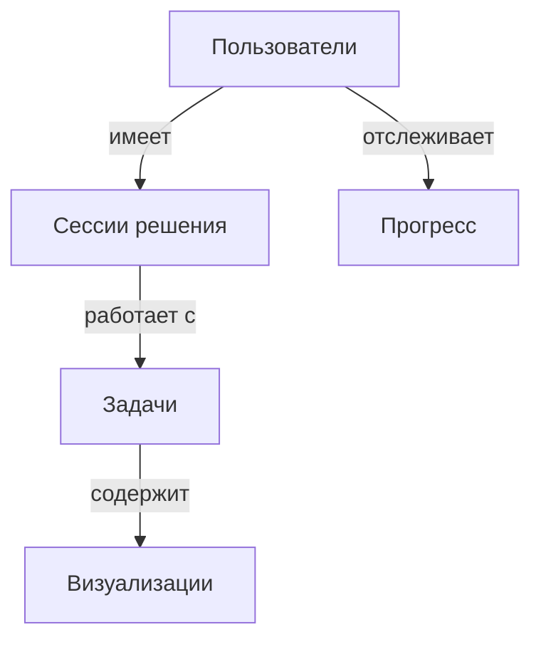

# Документ требований к продукту (PRD): Визуальный помощник по математике

## 1. Обзор и цели
**Название продукта**: Визуальный помощник для решения математических задач  
**Цель**: Создать веб-приложение, помогающее школьникам 10-16 лет понимать математику через пошаговые визуализированные решения  

**Основные ценности**:
- Интерактивное обучение через понимание, а не механическое запоминание
- Адаптация под разные стили обучения
- Доступность для учащихся с дислексией
- Персонализированный прогресс

## 2. Целевая аудитория
**Основные пользователи**:
- Ученики 10-16 лет (5-11 классы)
- Учащиеся с дислексией
- Самостоятельно изучающие математику

**Потребности**:
- Наглядные объяснения сложных концепций
- Понимание вместо списывания готовых ответов
- Адаптация под индивидуальный темп обучения

## 3. Основные функции (MVP)
1. **Распознавание математических выражений**:
   - Поддержка печатных и рукописных формул
   - Интеграция с Mathpix API

2. **Пошаговые решения с объяснениями**:
   - Алгоритмическое разбиение на этапы
   - Текстовые и голосовые пояснения
   - Возможность запроса дополнительных объяснений

3. **Базовые визуализации**:
   - Графики и диаграммы через D3.js
   - Анимации ключевых математических концепций

## 4. Техническая архитектура
**Фронтенд**:
- Next.js (TypeScript)
- Tailwind CSS + shadcn/ui
- MathJax для отображения формул

**Бэкенд**:
- Firebase/Supabase (на выбор):
  - Аутентификация через Google/GitHub OAuth
  - Хранение данных в Firestore/PostgreSQL
- Vercel хостинг

**Интеграции**:
- Mathpix API для распознавания формул
- Wolfram Alpha для сложных вычислений (по мере роста)

## 5. Модель данных (графовая структура)

**Основные сущности**:
1. **Пользователи**:
   - email (string)
   - имя (string)
   - аватар (url)

2. **Задачи**:
   - текст (string)
   - изображение (url)
   - теги (array)
   - сложность (number)

3. **Сессии решения**:
   - ID пользователя
   - ID задачи
   - потраченное время
   - использованные подсказки

4. **Визуализации**:
   - тип (graph, animation, diagram)
   - контент (json)
   - связанные задачи

## 6. Принципы UI/UX
**Доступность**:
- Шрифты OpenDyslexic
- Высококонтрастные темы
- Аудиоподдержка

**Интерфейс**:
- Минималистичный дизайн
- Прогрессивное раскрытие сложности
- Персонализируемая панель инструментов

## 7. Этапы разработки
1. **Прототип (1 месяц)**:
   - Базовое распознавание формул
   - Решение простых уравнений
   - OAuth аутентификация

2. **MVP (3 месяца)**:
   - Полный цикл решения задач
   - Система прогресса
   - Мобильная адаптация

3. **Реализация (6 месяцев)**:
   - Генератор похожих задач
   - Расширенная аналитика
   - Интеграция с образовательными стандартами

## 8. План масштабирования
**Квартал 1-2**:
- Добавление новых разделов математики
- Поддержка нескольких языков
- Базовая геймификация

**Квартал 3-4**:
- Интеграция с LMS системами
- API для школ и преподавателей
- Премиум подписка с расширенными функциями

**Год 1-2**:
- Мобильные приложения
- ИИ-репетитор с голосовым интерфейсом
- AR визуализации сложных концепций

## 9. Потенциальные вызовы
**Технические**:
- Точность распознавания рукописных формул
- Производительность сложных визуализаций
- Синхронизация состояния в реальном времени

**Образовательные**:
- Соответствие школьной программе
- Баланс между игрой и обучением
- Персонализация без перегрузки

**Бизнес**:
- Монетизация без ущерба доступности
- Конкуренция с существующими платформами
- Соответствие GDPR и законам об образовании