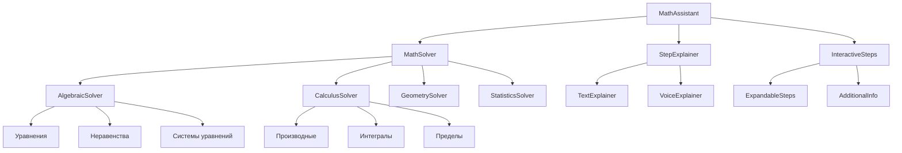
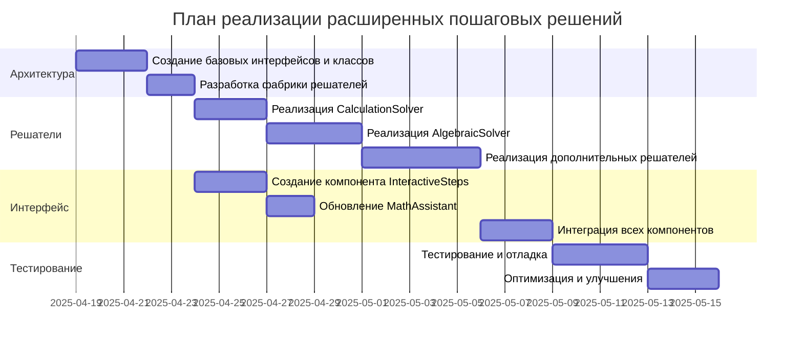

# План расширения пошаговых решений и объяснений

## 1. Архитектура системы пошаговых решений



## 2. Компоненты системы

### 2.1. Базовый класс MathSolver

Создадим абстрактный класс `MathSolver`, который будет основой для всех типов решений:

```typescript
// src/lib/solvers/MathSolver.ts
export interface SolutionStep {
  description: string;  // Описание шага
  formula: string;      // Формула в формате LaTeX
  explanation: string;  // Подробное объяснение
  detailedExplanation?: string; // Дополнительное объяснение (по запросу)
}

export interface Solution {
  steps: SolutionStep[];
  result: string;
  type: string;
  difficulty: 'basic' | 'intermediate' | 'advanced';
}

export abstract class MathSolver {
  abstract canSolve(input: string): boolean;
  abstract solve(input: string): Solution;
  abstract getType(): string;
}
```

### 2.2. Специализированные решатели

Реализуем несколько специализированных решателей для разных типов задач:

#### 2.2.1. Решатель алгебраических уравнений

```typescript
// src/lib/solvers/AlgebraicSolver.ts
import { MathSolver, Solution, SolutionStep } from './MathSolver';
import * as math from 'mathjs';

export class AlgebraicSolver extends MathSolver {
  canSolve(input: string): boolean {
    // Проверяем, является ли ввод уравнением
    return input.includes('=');
  }

  getType(): string {
    return 'algebraic';
  }

  solve(input: string): Solution {
    const steps: SolutionStep[] = [];
    
    // Разбиваем уравнение на левую и правую части
    const [left, right] = input.split('=').map(part => part.trim());
    
    // Шаг 1: Запись уравнения
    steps.push({
      description: 'Исходное уравнение',
      formula: `${left} = ${right}`,
      explanation: 'Начинаем с исходного уравнения, которое нужно решить.',
      detailedExplanation: 'Уравнение - это математическое равенство, содержащее одну или несколько переменных. Решить уравнение означает найти значения переменных, при которых равенство становится верным.'
    });
    
    // Шаг 2: Приведение к стандартной форме
    const standardForm = `${left} - (${right})`;
    const simplified = math.simplify(standardForm).toString();
    
    steps.push({
      description: 'Приведение к стандартной форме',
      formula: `${simplified} = 0`,
      explanation: 'Переносим все члены уравнения в левую часть, чтобы правая часть была равна нулю.',
      detailedExplanation: 'Стандартная форма уравнения вида "выражение = 0" упрощает дальнейшее решение. Для этого мы вычитаем правую часть из обеих частей уравнения.'
    });
    
    // Дальнейшие шаги решения...
    // Здесь будет логика для разных типов уравнений (линейные, квадратные и т.д.)
    
    // Пример для линейного уравнения ax + b = 0
    try {
      // Пытаемся найти переменную в уравнении
      const variables = math.parse(simplified).filter(node => node.isSymbolNode).map(node => node.name);
      const uniqueVars = [...new Set(variables)];
      
      if (uniqueVars.length === 1) {
        const variable = uniqueVars[0];
        
        // Решаем уравнение относительно переменной
        const equation = math.parse(`${simplified} = 0`);
        const solved = math.solve(equation, variable);
        
        steps.push({
          description: `Решение относительно переменной ${variable}`,
          formula: `${variable} = ${solved}`,
          explanation: `Выражаем переменную ${variable} из уравнения и находим её значение.`,
          detailedExplanation: `Для решения линейного уравнения вида ax + b = 0 относительно x, мы выполняем следующие действия: 1) Группируем члены с переменной, 2) Выносим переменную за скобки, 3) Делим обе части уравнения на коэффициент при переменной.`
        });
        
        return {
          steps,
          result: `${variable} = ${solved}`,
          type: 'linear-equation',
          difficulty: 'basic'
        };
      }
    } catch (error) {
      console.error('Error solving equation:', error);
    }
    
    // Если не удалось решить аналитически
    return {
      steps,
      result: 'Не удалось найти аналитическое решение',
      type: 'unknown-equation',
      difficulty: 'advanced'
    };
  }
}
```

#### 2.2.2. Решатель для вычислений

```typescript
// src/lib/solvers/CalculationSolver.ts
import { MathSolver, Solution, SolutionStep } from './MathSolver';
import * as math from 'mathjs';

export class CalculationSolver extends MathSolver {
  canSolve(input: string): boolean {
    // Проверяем, является ли ввод выражением для вычисления
    return !input.includes('=');
  }

  getType(): string {
    return 'calculation';
  }

  solve(input: string): Solution {
    const steps: SolutionStep[] = [];
    
    // Шаг 1: Парсинг выражения
    const node = math.parse(input);
    steps.push({
      description: 'Анализ выражения',
      formula: input,
      explanation: 'Разбираем математическое выражение на составные части.',
      detailedExplanation: 'Математический парсер анализирует структуру выражения, определяя операции, операнды и их порядок вычисления согласно правилам математики.'
    });
    
    // Шаг 2: Структура выражения
    steps.push({
      description: 'Структура выражения',
      formula: node.toString(),
      explanation: 'Представляем выражение в структурированном виде для анализа.',
      detailedExplanation: 'Структурное представление показывает иерархию операций в выражении, что помогает понять порядок вычислений.'
    });
    
    // Шаг 3: Пошаговое вычисление
    // Здесь можно добавить логику для разбиения сложных выражений на подвыражения
    // и их последовательного вычисления
    
    // Для примера, разбиваем на операции верхнего уровня
    if (node.type === 'OperatorNode') {
      const leftNode = node.args[0];
      const rightNode = node.args[1];
      
      const leftResult = math.evaluate(leftNode.toString());
      const rightResult = math.evaluate(rightNode.toString());
      
      steps.push({
        description: 'Вычисление подвыражений',
        formula: `${leftNode.toString()} = ${leftResult}, ${rightNode.toString()} = ${rightResult}`,
        explanation: 'Вычисляем каждую часть выражения отдельно.',
        detailedExplanation: 'Разбиение сложного выражения на более простые части позволяет последовательно вычислить результат, применяя базовые арифметические операции.'
      });
    }
    
    // Шаг 4: Итоговый результат
    const result = math.evaluate(input);
    steps.push({
      description: 'Итоговый результат',
      formula: `${input} = ${math.format(result)}`,
      explanation: 'Получаем окончательный результат вычисления выражения.',
      detailedExplanation: 'После выполнения всех операций в правильном порядке, получаем числовое значение, которое является результатом вычисления исходного выражения.'
    });
    
    return {
      steps,
      result: math.format(result),
      type: 'calculation',
      difficulty: 'basic'
    };
  }
}
```

### 2.3. Фабрика решателей

```typescript
// src/lib/solvers/SolverFactory.ts
import { MathSolver } from './MathSolver';
import { AlgebraicSolver } from './AlgebraicSolver';
import { CalculationSolver } from './CalculationSolver';
// Импорт других решателей

export class SolverFactory {
  private solvers: MathSolver[] = [];
  
  constructor() {
    // Регистрируем все доступные решатели
    this.solvers.push(new AlgebraicSolver());
    this.solvers.push(new CalculationSolver());
    // Добавление других решателей
  }
  
  getSolverForInput(input: string): MathSolver | null {
    // Находим подходящий решатель для данного ввода
    for (const solver of this.solvers) {
      if (solver.canSolve(input)) {
        return solver;
      }
    }
    return null;
  }
}
```

### 2.4. Компонент интерактивных шагов

```typescript
// src/components/InteractiveSteps.tsx
import React, { useState } from 'react';
import MathDisplay from './MathDisplay';
import { SolutionStep } from '@/lib/solvers/MathSolver';

interface InteractiveStepsProps {
  steps: SolutionStep[];
}

const InteractiveSteps: React.FC<InteractiveStepsProps> = ({ steps }) => {
  const [expandedSteps, setExpandedSteps] = useState<number[]>([]);
  
  const toggleExpand = (index: number) => {
    if (expandedSteps.includes(index)) {
      setExpandedSteps(expandedSteps.filter(i => i !== index));
    } else {
      setExpandedSteps([...expandedSteps, index]);
    }
  };
  
  return (
    <div className="space-y-4">
      <h3 className="font-bold text-lg text-blue-700 dark:text-blue-300">Процесс решения:</h3>
      
      <div className="space-y-6">
        {steps.map((step, index) => (
          <div 
            key={index} 
            className="p-4 bg-white dark:bg-gray-800 rounded-lg shadow-sm border border-blue-100 dark:border-blue-900"
          >
            <div className="flex justify-between items-center mb-2">
              <h4 className="font-medium text-gray-800 dark:text-gray-200">
                {index + 1}. {step.description}
              </h4>
              {step.detailedExplanation && (
                <button
                  onClick={() => toggleExpand(index)}
                  className="text-blue-600 hover:text-blue-500 dark:text-blue-400 dark:hover:text-blue-300 text-sm"
                >
                  {expandedSteps.includes(index) ? 'Скрыть подробности' : 'Подробнее'}
                </button>
              )}
            </div>
            
            <div className="my-3">
              <MathDisplay formula={step.formula} />
            </div>
            
            <p className="text-gray-700 dark:text-gray-300 text-sm">
              {step.explanation}
            </p>
            
            {step.detailedExplanation && expandedSteps.includes(index) && (
              <div className="mt-3 p-3 bg-blue-50 dark:bg-blue-900/30 rounded-md text-sm text-gray-700 dark:text-gray-300 border-l-4 border-blue-500">
                {step.detailedExplanation}
              </div>
            )}
          </div>
        ))}
      </div>
    </div>
  );
};

export default InteractiveSteps;
```

## 3. Обновление компонента MathAssistant

Обновление основного компонента MathAssistant для использования новой системы решений.

## 4. Поддержка различных типов математических задач

В рамках расширения функциональности, мы реализуем поддержку следующих типов задач:

1. **Алгебра**:
   - Линейные уравнения (ax + b = c)
   - Квадратные уравнения (ax² + bx + c = 0)
   - Системы линейных уравнений
   - Неравенства

2. **Арифметика**:
   - Вычисление выражений
   - Дроби и проценты
   - Степени и корни

3. **Начальный анализ**:
   - Простые производные
   - Базовые интегралы
   - Пределы функций

## 5. Этапы реализации



## 6. Примеры пошаговых решений

### 6.1. Линейное уравнение: 2x + 3 = 7

1. **Исходное уравнение**:
   - Формула: 2x + 3 = 7
   - Объяснение: Начинаем с исходного уравнения, которое нужно решить.

2. **Приведение к стандартной форме**:
   - Формула: 2x + 3 - 7 = 0
   - Объяснение: Переносим все члены уравнения в левую часть.

3. **Упрощение**:
   - Формула: 2x - 4 = 0
   - Объяснение: Упрощаем выражение, выполняя арифметические операции.

4. **Выделение переменной**:
   - Формула: 2x = 4
   - Объяснение: Переносим все члены без переменной в правую часть.

5. **Решение относительно x**:
   - Формула: x = 2
   - Объяснение: Делим обе части уравнения на коэффициент при x.

### 6.2. Квадратное уравнение: x² - 5x + 6 = 0

1. **Исходное уравнение**:
   - Формула: x² - 5x + 6 = 0
   - Объяснение: Начинаем с исходного квадратного уравнения.

2. **Определение коэффициентов**:
   - Формула: a = 1, b = -5, c = 6
   - Объяснение: Выделяем коэффициенты при x², x и свободный член.

3. **Вычисление дискриминанта**:
   - Формула: D = b² - 4ac = (-5)² - 4·1·6 = 25 - 24 = 1
   - Объяснение: Вычисляем дискриминант по формуле D = b² - 4ac.

4. **Нахождение корней**:
   - Формула: x₁ = (-b + √D) / (2a) = (5 + 1) / 2 = 3
   - Формула: x₂ = (-b - √D) / (2a) = (5 - 1) / 2 = 2
   - Объяснение: Находим корни уравнения по формуле x = (-b ± √D) / (2a).

5. **Проверка**:
   - Формула: 3² - 5·3 + 6 = 9 - 15 + 6 = 0 ✓
   - Формула: 2² - 5·2 + 6 = 4 - 10 + 6 = 0 ✓
   - Объяснение: Проверяем найденные корни, подставляя их в исходное уравнение.